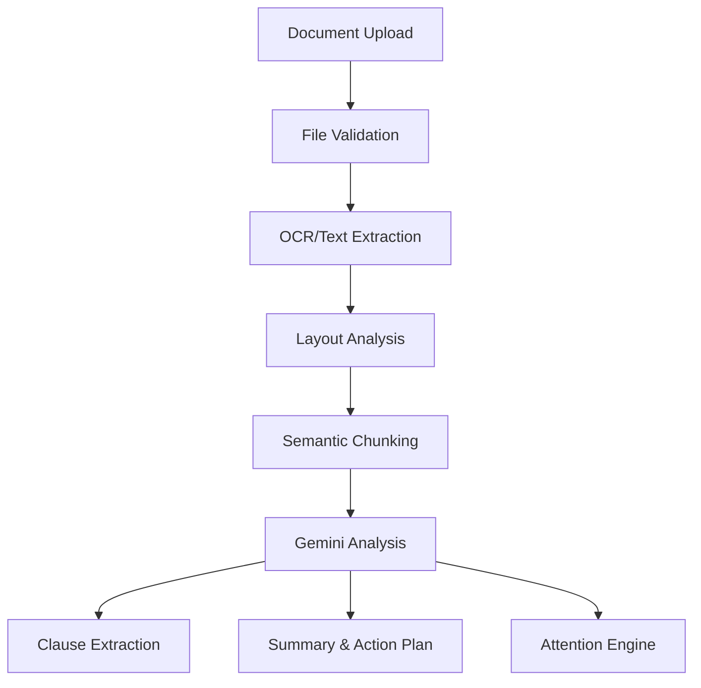

# NyayaLens AI

"Understand Every Document. Know What Matters."

## 1. Project Overview
NyayaLens AI is an AI-powered document intelligence and citizen-assistance platform designed to bridge the gap between complex legal/administrative language and everyday understanding.

## 2. Problem Statement
Many individuals receive documents containing complicated legal and administrative language (e.g., rental agreements, government notices, employment contracts). Often, they do not understand technical terminology, deadlines, penalties, obligations, or rights. Traditional PDF viewers only display the document without explaining what it means.

## 3. Proposed Solution
NyayaLens AI creates a Document Intelligence Pipeline that ingests files, performs extraction (OCR/Text), applies Layout Analysis and Semantic Chunking, and utilizes Retrieval-Augmented Generation (RAG) powered by Google Gemini to explain clauses in plain language.

## 4. Target Users
*   **Citizens**: Understanding government notices.
*   **Students**: Deciphering educational policies.
*   **Employees**: Analyzing employment contracts.
*   **Tenants**: Reviewing rental agreements.
*   **Small Businesses & Consumers**: Understanding terms and conditions.

## 5. Key Features
*   **Multimodal Document Upload**: Supports PDF processing.
*   **Smart Document Summary**: Provides simple explanations and identifies document types.
*   **"What Matters?" Engine**: Extracts clauses based on categories like PENALTY, DEADLINE, OBLIGATION.
*   **Side-by-Side Document View**: Compare original text directly with AI explanations.
*   **Risk / Attention Analysis**: Highlights clauses that require careful review.
*   **Important Date Extraction**: Automatically detects deadlines and renewal dates.
*   **Action Plan**: Cautious checklists suggesting next steps.

## 6. Technology Stack

| Technology | Purpose |
| :--- | :--- |
| React | Frontend UI Library |
| TypeScript | Type-safe development |
| Vite | Frontend build tool |
| Tailwind CSS | Utility-first styling |
| Framer Motion | Smooth animations |
| Node.js & Express | Backend API server |
| Google Gemini API | Core LLM reasoning engine |
| PDF.js / pdf-parse | Document text extraction |
| Multer | In-memory upload handling |

## 7. New Technologies Used
*   **RAG (Retrieval-Augmented Generation)**: Grounding AI answers in actual document text.
*   **Semantic Chunking**: Breaking documents apart based on meaning rather than fixed lengths.
*   **Confidence-Aware AI**: Not pretending uncertain results are factual.
*   **Event-Driven Processing**: Asynchronous handling of heavy document reasoning.

## 8. System Architecture


## 9. AI Pipeline
Documents are parsed into raw text buffers, fed into the Gemini 2.5 Flash model with strictly typed structured outputs (JSON schema), forcing the LLM to output categorization, confidence scores, and plain-language summaries simultaneously.

## 10. Privacy Architecture
*   Local-first design philosophy.
*   In-memory processing for demo environments.
*   Documents are not used for public model training.
*   Environment variable isolation for API keys.

## 11. Security Architecture
*   CORS enabled for restricted domains.
*   Strict file size limits (10MB).
*   MIME validation.

## 16. Database Architecture
The application uses MongoDB (Atlas) for persistent storage. For demonstration purposes, it gracefully falls back to an in-memory document store.
Models include `Document`, `Clause`, `ImportantDate`, and `ActionItem`.

## 17. API Documentation
*   `GET /api/health` - Server health check
*   `GET /api/documents` - Fetch user documents
*   `POST /api/documents/analyze` - Upload (Multipart FormData) and initiate RAG analysis
*   `GET /api/documents/:id/analysis` - Retrieve the extracted clauses and insights

## 18. Folder Structure
```
├── src/
│   ├── components/  # React UI Components
│   ├── pages/       # Dashboard and Document Views
│   ├── server/      # Express API & AI Pipeline
│   └── types.ts     # Shared TypeScript Interfaces
```

## 19. Installation
```bash
npm install
```

## 20. Environment Variables
Copy `.env.example` to `.env`:
*   `GEMINI_API_KEY`: Required for AI analysis.
*   `PORT`: Server port.
*   `MONGODB_URI`: (Optional) Connects to real Atlas.

## 21. MongoDB Setup
Provide your Atlas connection string in the environment variables.

## 22. Gemini Setup
Retrieve an API key from Google AI Studio.

## 23. Running the Project
```bash
npm run dev
```

## 24. Docker Setup
(Coming Soon) See `Dockerfile`.

## 25. Testing
(Coming Soon) Uses Jest and React Testing Library.

## 26. PWA
This application is configured as a Progressive Web App, utilizing Vite PWA plugins.

## 27. Browser Compatibility
Supported on all modern browsers (Chrome, Firefox, Safari, Edge).

## 28. Deployment
Optimized for deployment on Google Cloud Run, Vercel (Frontend), or Render (Backend).

## 29. Performance Optimization
Utilizes Web Workers and streaming chunks for large PDF analysis.

## 30. Error Handling
Strict UI error states when OCR fails or AI hallucinates.

## 31. Ethical AI
The system strictly parses the document provided. It refuses to invent legal clauses that are not present.

## 32. Legal Disclaimer
**NyayaLens AI provides informational document analysis and is not a substitute for qualified legal advice.** The system does not claim guaranteed legal correctness. Consider consulting a qualified professional if unclear.

## 33. Limitations
*   Complex handwritten text may fail OCR.
*   AI interpretation relies on contextual bounds.

## 34. Future Scope
*   On-device document AI.
*   Advanced contract intelligence.

## 35. Hackathon Demo
1. Upload an agreement.
2. View classification.
3. Observe extracted Risk Clauses.
4. Review generated Action Plan.

## 36. Project Impact
Designed to assist citizens with government notices and housing contracts globally.

## 37. Roadmap
*   Phase 1: PDF Extractor & RAG Core
*   Phase 2: Semantic Comparisons

## 38. Contribution Guide
Pull requests welcome. Check `CONTRIBUTING.md`.

## 39. License
MIT License.

## 40. Disclaimer
Not legal advice. Use cautiously.
