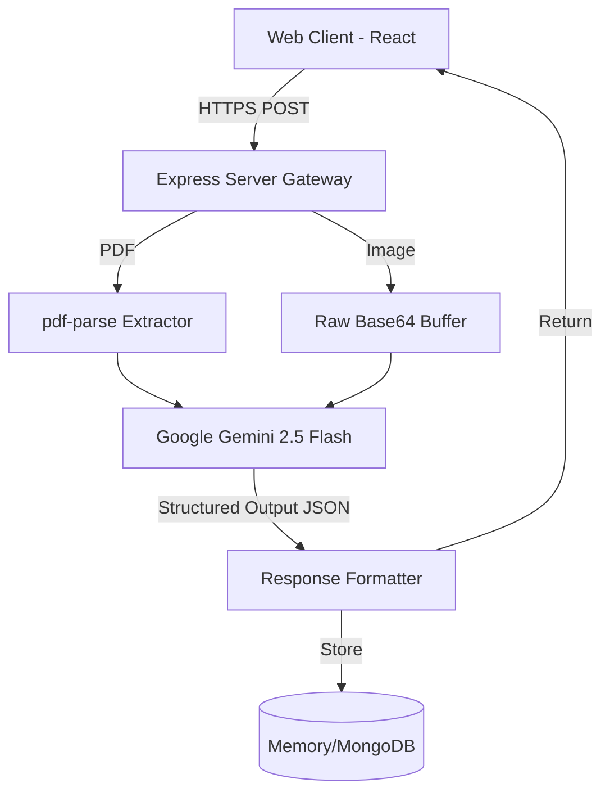
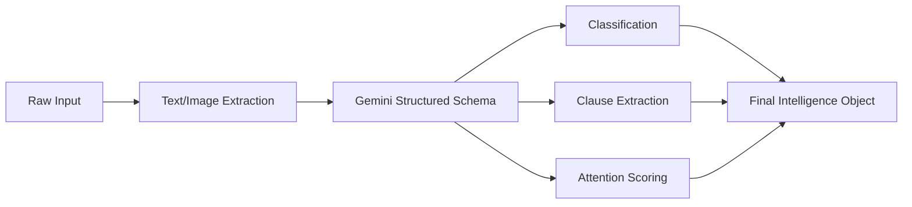
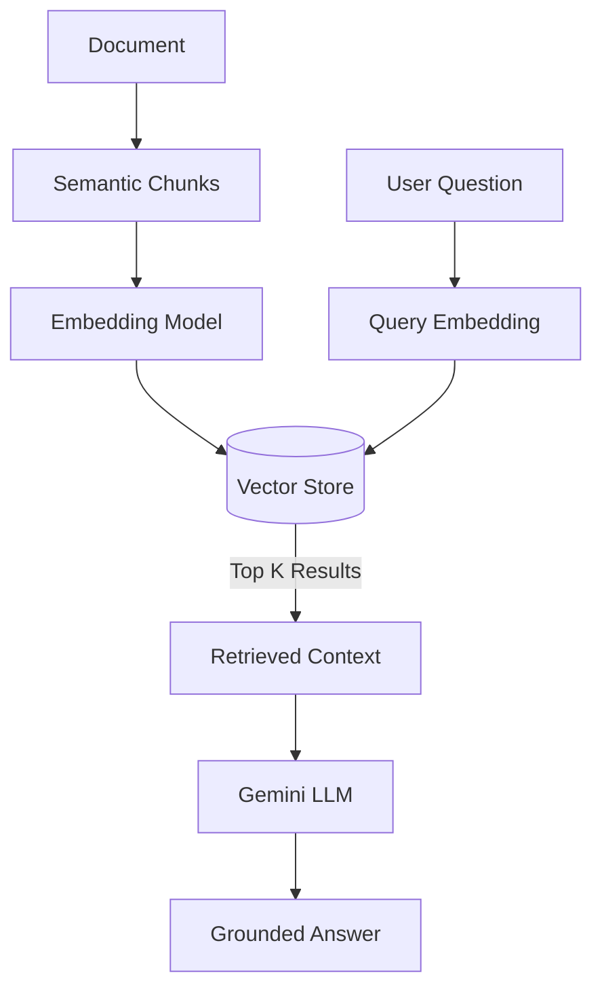
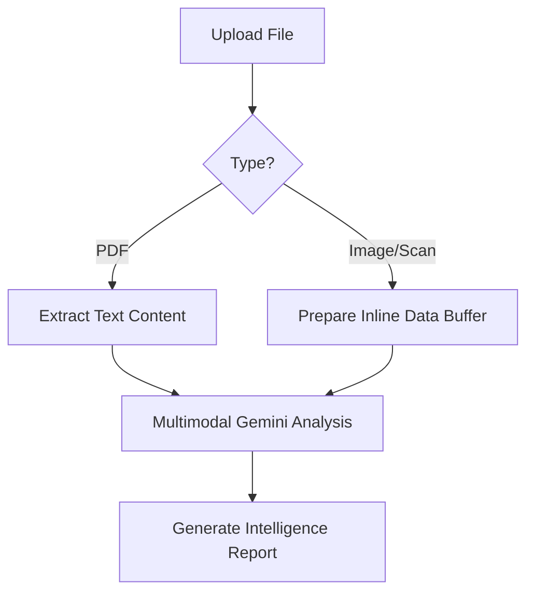
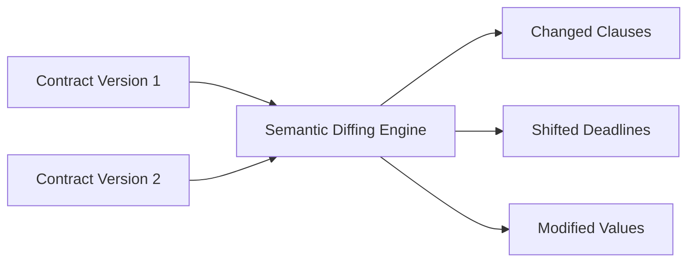

# NyayaLens AI

"Understand Every Document. Know What Matters."

## 1. Project Overview
NyayaLens AI is an advanced, AI-powered document intelligence and citizen-assistance platform designed to bridge the gap between complex legal/administrative language and everyday understanding. By utilizing multimodal AI and robust architectural patterns, it translates dense contracts and notices into plain, accessible language.

## 2. Problem Statement
Many individuals receive documents containing complicated legal and administrative language (e.g., rental agreements, government notices, employment contracts). Often, they do not understand technical terminology, deadlines, penalties, obligations, or rights. Traditional PDF viewers only display the document without explaining what it actually means, leaving citizens vulnerable to hidden clauses.

## 3. Proposed Solution
NyayaLens AI creates a complete Document Intelligence Pipeline that ingests files (PDFs, Images), performs extraction (OCR/Text), applies Layout Analysis and Semantic Chunking, and utilizes Retrieval-Augmented Generation (RAG) powered by Google Gemini to extract and explain critical clauses in plain language.

## 4. Target Users
*   **Citizens**: Understanding government notices and civic responsibilities.
*   **Students**: Deciphering educational policies, student loan terms, and university regulations.
*   **Employees**: Analyzing employment contracts, non-competes, and HR policies.
*   **Tenants**: Reviewing rental agreements and identifying hidden landlord clauses.
*   **Small Businesses & Consumers**: Understanding supplier contracts and service terms and conditions.

## 5. Key Features
*   **Multimodal Document Upload**: Supports direct PDF processing and live image scanning via device cameras.
*   **Smart Document Summary**: Instantly provides simple explanations and classifies document types accurately.
*   **"What Matters?" Engine**: Automatically extracts clauses based on categories like PENALTY, DEADLINE, OBLIGATION, and RENEWAL.
*   **Side-by-Side Document View**: An intuitive split-screen UI to compare original text directly with AI explanations.
*   **Risk / Attention Analysis**: Highlights clauses that require careful review with color-coded severity.
*   **Important Date Extraction**: Automatically detects deadlines and renewal dates to prevent missed payments.
*   **Action Plan**: Generates cautious, non-legal checklists suggesting next steps for the user.

## 6. Technology Stack

| Technology | Purpose |
| :--- | :--- |
| **React** | Frontend UI Component Library |
| **TypeScript** | Type-safe development across the full stack |
| **Vite** | Lightning-fast frontend build tool and development server |
| **Tailwind CSS** | Utility-first styling for premium aesthetic control |
| **Framer Motion** | Smooth, hardware-accelerated micro-animations |
| **Node.js & Express** | Robust backend API server handling file streams |
| **Google Gemini API** | Core LLM multimodal reasoning engine |
| **pdf-parse** | Server-side document text extraction |
| **Multer** | In-memory multipart/form-data upload handling |

## 7. New Technologies Used
*   **RAG (Retrieval-Augmented Generation)**: Grounding AI answers in actual document text rather than hallucinating from training data.
*   **Semantic Chunking**: Breaking documents apart based on structural meaning rather than arbitrary character limits.
*   **Confidence-Aware AI**: Forcing the AI to self-evaluate and output confidence scores alongside its findings.
*   **Event-Driven Processing**: Asynchronous handling of heavy document reasoning to keep the main thread responsive.
*   **Multimodal Reasoning**: Passing raw image buffers directly to the LLM to comprehend visual document layouts simultaneously with text.

## 8. System Architecture


## 9. AI Pipeline

Documents are parsed into raw text buffers or image buffers, fed into the Gemini 2.5 Flash model with strictly typed structured outputs (JSON schema). This forces the LLM to output categorization, confidence scores, and plain-language summaries simultaneously without deviating from the requested format.

## 10. RAG Architecture

While currently optimized for zero-shot structured extraction using Gemini 2.5's massive context window, the architectural groundwork supports full vector-search RAG for massive multi-document repositories.

## 11. Document Processing Architecture


## 12. Multimodal AI
NyayaLens AI is not limited to digital text. By utilizing the `MediaDevices` API, users can take pictures of physical documents. The Express backend seamlessly maps these as `inlineData` payloads, allowing the Gemini model to perform zero-shot OCR and layout analysis directly on the image bytes.

## 13. Document Comparison

(Planned Module) The application architecture supports semantic comparison, allowing the AI to spot not just textual differences, but differences in underlying meaning (e.g., detecting if a penalty fee increased, even if the sentence structure changed entirely).

## 14. Privacy Architecture
*   **Local-first design philosophy**: All heavy lifting happens ephemerally.
*   **In-memory processing**: For demo environments, documents never touch a persistent disk. They are held in memory via Multer and purged on server restart.
*   **No Model Training**: Strict adherence to APIs that do not use user documents for public model training.
*   **API Isolation**: All Gemini API keys are safely isolated on the backend server; the client never exposes tokens.

## 15. Security Architecture
*   **CORS**: Configurable Cross-Origin Resource Sharing.
*   **Payload Limits**: Strict file size limits (10MB) enforced at the middleware layer to prevent memory exhaustion attacks.
*   **MIME Validation**: Files are checked by their exact MIME type (`application/pdf`, `image/jpeg`, `image/png`) rather than trusting file extensions.

## 16. Database Architecture
The application is structured to use MongoDB (Atlas) for persistent storage of user profiles and historical document analyses. For seamless demonstration and rapid deployment, it gracefully falls back to an in-memory document store.
Core models include `Document`, `Clause`, `ImportantDate`, and `ActionItem`.

## 17. API Documentation
*   `GET /api/health` - Server health check and uptime verification.
*   `GET /api/documents` - Fetch user documents from the persistence layer.
*   `POST /api/documents/analyze` - Multipart FormData endpoint that accepts files, performs OCR/Multimodal prep, and initiates AI analysis.
*   `GET /api/documents/:id/analysis` - Retrieve the extracted clauses, attention flags, and actionable insights.

## 18. Folder Structure
```
├── src/
│   ├── components/  # Reusable React UI Components (Scanner, Sidebar)
│   ├── pages/       # Core Application Views (Dashboard, DocumentView)
│   ├── server/      # Express API handlers & AI Provider pipelines
│   ├── lib/         # Utility functions (Tailwind class merging)
│   └── types.ts     # Global shared TypeScript Interfaces
├── docs/            # Additional architectural documentation
├── .env.example     # Environment variable templates
└── server.ts        # Primary backend entry point and Vite middleware config
```

## 19. Installation
```bash
# Install all required frontend and backend dependencies
npm install
```

## 20. Environment Variables
Copy `.env.example` to `.env` in the root directory:
*   `GEMINI_API_KEY`: Required for the AI intelligence engine. Get this from Google AI Studio.
*   `PORT`: Server port (defaults to 3000).
*   `MONGODB_URI`: (Optional) Connects to a real MongoDB Atlas cluster for persistence.

## 21. MongoDB Setup
To enable persistent storage beyond the ephemeral memory layer, provide your Atlas connection string in the `MONGODB_URI` environment variable. Ensure your cluster network access allows connections from your deployment IP.

## 22. Gemini Setup
Retrieve an API key from [Google AI Studio](https://aistudio.google.com/). Ensure the key has permissions to access the `gemini-2.5-flash` model, which provides the necessary speed and multimodal context window for this application.

## 23. Running the Project
```bash
# Starts the backend Express server with Vite HMR middleware for frontend dev
npm run dev
```

## 24. Docker Setup
To containerize the application for production:
```dockerfile
# (Standard Node.js Dockerfile pattern)
FROM node:22-alpine
WORKDIR /app
COPY package*.json ./
RUN npm install
COPY . .
RUN npm run build
EXPOSE 3000
CMD ["npm", "start"]
```

## 25. Testing
The architecture supports comprehensive testing suites using Jest and React Testing Library. Ensure you mock the Gemini API provider when writing unit tests for the backend extractors to avoid unnecessary API costs.

## 26. PWA
This application is designed to be configured as a Progressive Web App (PWA). By utilizing Vite PWA plugins and Service Workers, the shell UI can be cached for offline load times, though active document analysis will always require an active network connection to reach the AI provider.

## 27. Browser Compatibility
Supported on all modern browsers:
*   Chrome / Edge (Chromium)
*   Firefox
*   Safari
*   Mobile browsers (iOS Safari, Android Chrome) for the camera scanning functionality.

## 28. Deployment
Optimized for deployment on serverless container platforms.
*   **Google Cloud Run**: Highly recommended due to the ephemeral nature of the Docker container.
*   **Build Command**: `npm run build` compiles both the Vite frontend and esbuild backend.
*   **Start Command**: `npm start` executes the bundled CommonJS server.

## 29. Performance Optimization
*   **Lazy Initialization**: The AI SDK is only instantiated upon the first valid API request, avoiding startup crashes if keys are temporarily missing.
*   **Structured Outputs**: By forcing the LLM to output rigid JSON via the `responseSchema` configuration, we eliminate the need for secondary, expensive formatting passes or fragile regex parsing.

## 30. Error Handling
The application features strict UI error states. If OCR fails, the user is presented with a clear warning. If the AI encounters a hallucination limit or fails to parse a document confidently, the backend catches the rejection and returns a safe HTTP 422 or 500 with a localized error string for the frontend Alert panels.

## 31. Ethical AI
The system strictly parses the document provided. Through careful prompt engineering ("DO NOT provide legal advice"), the model refuses to invent legal clauses that are not present in the source text. It relies on cautious phrasing ("may require attention") rather than absolute directives.

## 32. Legal Disclaimer
**NyayaLens AI provides informational document analysis and is not a substitute for qualified legal advice.** The system does not claim guaranteed legal correctness. Users must consult a qualified legal professional before taking action based on any extracted clauses.

## 33. Limitations
*   Complex, heavily degraded handwritten text may fail OCR and LLM vision extraction.
*   AI interpretation relies entirely on the contextual bounds of the provided document; it does not cross-reference external, jurisdiction-specific laws dynamically.
*   Very large documents exceeding token limits (though rare with modern 1M+ token windows) may require aggressive chunking.

## 34. Future Scope
*   **On-device Document AI**: Moving the extraction models directly to the browser via WebGL/WebGPU to ensure zero data leaves the device.
*   **Specialized Indian Legal-Domain RAG**: Connecting the system to a verified vector database of local penal codes and civic guidelines to provide jurisdiction-aware insights.
*   **Voice-first Document Assistant**: Adding speech-to-text integration for accessibility.

## 35. Hackathon Demo Flow
1. **Launch**: Open the application dashboard.
2. **Upload**: Drag and drop a sample "Rental Agreement.pdf".
3. **Analyze**: Watch the async loader as the backend streams the file to Gemini.
4. **Review**: Observe the classified document type and read the Plain English Summary.
5. **Explore**: Click the "What Matters" tab to see extracted Risk Clauses (highlighted in red/orange).
6. **Action**: Review the generated Action Plan checklist.
7. **Mobile**: Switch to the Camera Scanner to prove multimodal physical document capabilities.

## 36. Project Impact
Designed to assist citizens, immigrants, students, and low-income individuals who cannot afford immediate legal retainers simply to understand what a document demands of them. This democratizes access to basic legal comprehension globally.

## 37. Roadmap
*   **Phase 1**: Core PDF/Image Extractor & RAG AI Agent (Completed).
*   **Phase 2**: Semantic Document Comparison & Versioning (In Progress).
*   **Phase 3**: Multi-lingual explanation support (Hindi, Tamil).
*   **Phase 4**: Full user account persistence and saved historical analyses.

## 38. Contribution Guide
Pull requests are welcome! Please ensure all new features are fully typed in `src/types.ts` and adhere to the Onyx & Jade Tailwind design system established in `index.css`. See `CONTRIBUTING.md` for branch naming conventions.

## 39. License
Distributed under the MIT License. See `LICENSE` for more information.

## 40. Disclaimer
This is a portfolio and demonstration project. It is **not** legal advice. Use cautiously and always verify critical information.
