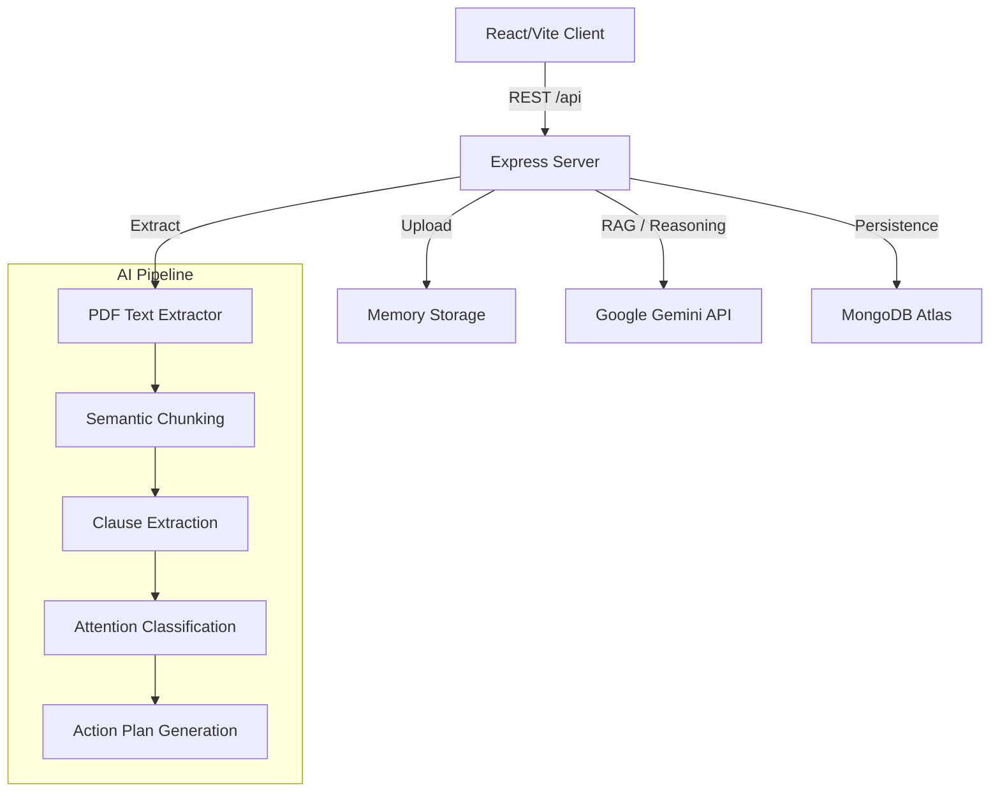

# Architecture Overview

NyayaLens AI is a full-stack web application designed for multimodal document intelligence.

## System Architecture

## Layers
1. **Presentation**: React, Tailwind CSS, Framer Motion.
2. **Backend**: Express.js handling business logic, document parsing, and file handling.
3. **AI Provider Abstraction**: Interface for LLMs (currently leveraging @google/genai).
4. **Data Persistence**: MongoDB (with fallback in-memory caching for demo environments).
